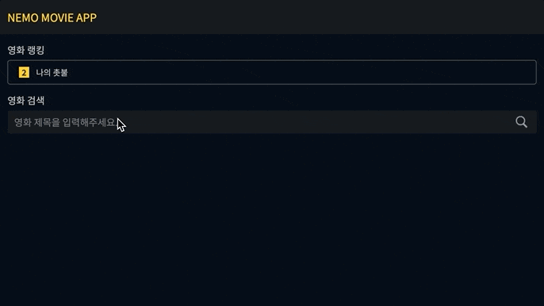

# Movie search App

📎 [Demo](https://nemo-movie-app.herokuapp.com/)

<br/>



<br/>

## Introduction
- 영화 검색 기능, 랭킹 정보가 있는 애플리케이션입니다.
- 네이버 OPEN API로 검색 기능을 구현하였습니다. 
- Cheerio 라이브러리를 사용해 크롤링하여 실시간 영화 랭킹을 구현하였습니다.

<br/>

## Tech Stack
- Client: React, TypeScript, SCSS
- Backend: Node.js, Express.js

<br/>

## Tree
```
movie-app
├── client
│   ├── public (정적 자원 관리)
│   │   ├── images
│   │   └── index.html
│   ├── src
│   │   ├── components (컴포넌트 관리)
│   │   │   ├── Config.js (상용 코드 관리)
│   │   │   └── views
│   │   │       ├── Footer
│   │   │       │   └── Footer.tsx
│   │   │       ├── LandingPage
│   │   │       │   ├── LandingPage.tsx (랜딩 페이지 틀)
│   │   │       │   └── Sections (랜딩 페이지 각 섹션)
│   │   │       │       └── Search (검색 영역)
│   │   │       │           ├── Ranking.tsx (실시간 랭킹)
│   │   │       │           ├── Search.tsx (검색어 입력창)
│   │   │       │           └── SearchResult.tsx (검색 결과)
│   │   │       ├── NavBar
│   │   │       │   └── NavBar.tsx
│   │   │       └── NotFound (404 페이지)
│   │   │           └── NotFound.tsx
│   │   ├── App.tsx
│   │   ├── index.tsx
│   │   ├── App.scss (글로벌 스타일)
│   │   ├── common.scss (공통 스타일)
│   │   ├── index.scss (기본&리셋 스타일)
│   │   └── setupProxy.js (프록시 미들웨어 관리)
│   └── tsconfig.json
├── server 
│   ├── fetching.js (영화 순위 크롤링 모듈)
│   └── index.js (서버 관리)
├── README.md
├── package-lock.json
└── package.json
```
